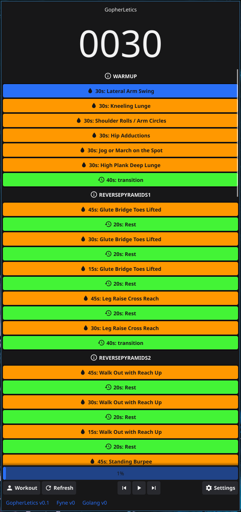

# GopherLetics
GopherLetics is a gui-based workout companion, fed by workout API [@fitness.sebhulse.com](https://fitness.sebhulse.com/index.html), helping you to focus on your exercises without distraction.

## Sidenote
This project has to be seen as
- **Fun hobby-project for a noob**
- **work in progress**
- No focus on stability/security/architecture

## What i wanted to learn
`golang` `fyne` `GitHub Actions` `GitHub Releases` `GitHub Changelog` `commitizen` `Go Release Build` `Release-Please`

## ToDo
- [ ] Working base
- [ ] Multi-OS build
- [ ] More settings
- [ ] ...

## ChangeLog
See [CHANGELOG.md](https://github.com/SHU-red/GopherLetics/blob/main/CHANGELOG.md)

## Gui/Usage

- Timer  [Upper Left] showing the current countdown
- Step List [Lower Left] shows the whole workout and highlights the current step
- Exercise View [Right] shows details for the current and next exercise

## Contribute
Feel free to contribute, but keep in mind you are talking to a person which has never learned how to maintain a clean repository