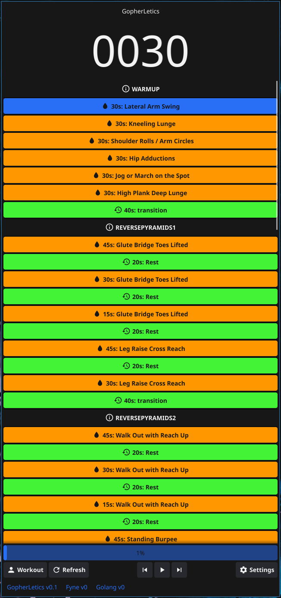

# GopherLetics

A GUI-based workout companion that generates and guides you through exercise routines — fully offline, with accurate exercise images for every movement.



## Features

- **Workout generation** — Pick duration, type (strength/cardio/mixed), area (full/upper/lower/core), level, and equipment. The internal generator creates warmup, main sets, and cooldown from 873 exercises.
- **Exercise images** — Every exercise shows its correct start/end position images, cycled as a flipbook animation. Sourced from [Free Exercise DB](https://github.com/yuhonas/free-exercise-db) (public domain).
- **Timed countdown** — Play/pause with per-exercise timer, acoustic countdown, and progress bar.
- **Text-to-speech** — Exercise names, countdown, and motivational prompts (configurable).
- **Keyboard shortcuts** — Space (play/pause), arrows (prev/next exercise), R (refresh), S (settings), W (workout config).
- **Fully offline** — Exercise database is cached locally after the first download. No internet needed for workout generation.

## Build

Requires Go 1.26+ and a C compiler.

### Linux (Wayland)

```sh
sudo xbps-install -Syu \
  alsa-lib-devel libglvnd-devel wayland-devel \
  libxkbcommon-devel

go build -tags wayland -o GopherLetics .
```

### macOS

```sh
go build -o GopherLetics .
```

### Windows (cross-compile from Linux)

```sh
sudo apt install mingw-w64
CGO_ENABLED=1 GOOS=windows GOARCH=amd64 CC=x86_64-w64-mingw32-gcc \
  go build -ldflags="-H windowsgui" -o GopherLetics.exe .
```

Or use `fyne-cross` for proper packaging:

```sh
go install github.com/fyne-io/fyne-cross@latest
fyne-cross linux -tags wayland
fyne-cross windows
```

## Usage

1. **Configure workout** — Click "Workout" to set duration, type, area, level, equipment, and template.
2. **Generate** — Click "Refresh" to create a new workout from your settings.
3. **Start** — Press the Play button or hit `Space`. The timer counts down each exercise.
4. **Navigate** — Use Previous/Next buttons or arrow keys to skip between exercises.

## Data Sources

- **Exercises & images**: [Free Exercise DB](https://github.com/yuhonas/free-exercise-db) — 873 exercises with start/end position images. Public domain (Unlicense).
- **Workout templates**: Built-in (Classic Strength, Pyramid Strength, Cardio HIIT) — fully generated locally, no external API.

## License

MIT — see [LICENSE](LICENSE).

## Support

If you find GopherLetics useful, consider supporting its development:

[☕ Buy me a coffee](https://buymeacoffee.com/yffbptmtaa)
